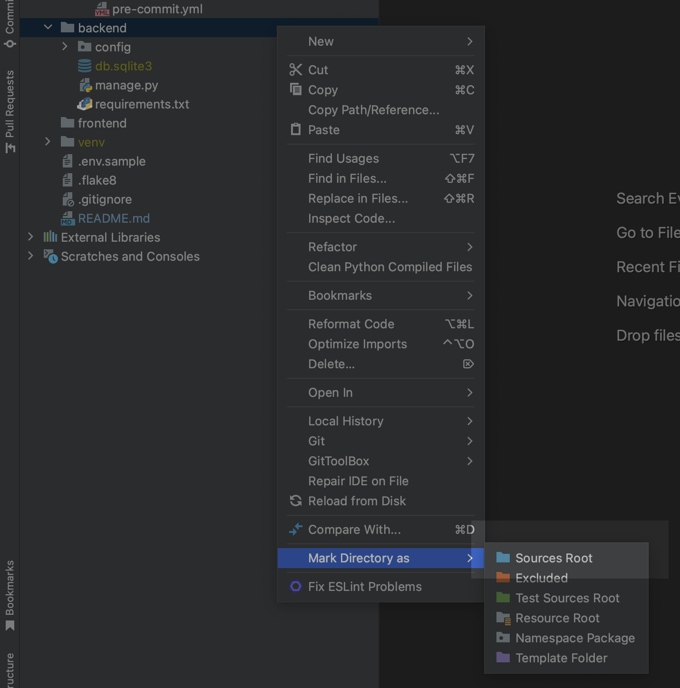

# Lteam project - Wine map site

## Installing backend

Python 3.10+ is a must

1. Clone the repository in the terminal:
`git clone https://github.com/Nattalli/lteam-wine-map.git`
2. Make the following command and populate it with required data:
`cp .env.sample .env`
3. Create virtual env:
`python3.10 -m venv venv`
4. Setup virtual env:
    * On Windows: `venv\Scripts\activate`
    * On Linux or MacOS: `source venv/bin/activate`
5. Go to the `backend` folder `cd backend`
6. And mark it as the source root 

7. Install requirements: `pip install -r requirements.txt`
8. Make migrations: `python manage.py migrate`
9. Create superuser to access the admin panel: `python manage.py createsuperuser`. Or you can use already existed credentials.
10. Now you can run it: `python manage.py runserver`

## Installing frontend

1. First, make sure you have Node.js LTS version(18.14.2 for now) installed on your computer. You can download it from the official Node.js website https://nodejs.org/en/.
2. Once the installation is complete, navigate to the frontend directory and run:
```
npm install
```

### Available frontend scripts

In the project directory, you can run:

```
npm start
```

Runs the app in the development mode.\
Open [http://localhost:3000](http://localhost:3000) to view it in the browser.

The page will reload if you make edits.\
You will also see any lint errors in the console.

```
npm run build
```

Builds the app for production to the `build` folder.\
It correctly bundles React in production mode and optimizes the build for the best performance.

The build is minified and the filenames include the hashes.
